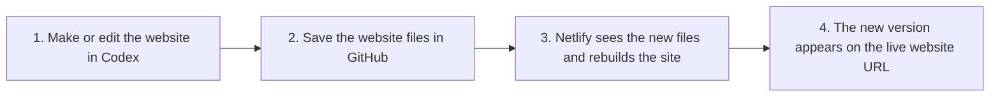

# Singapore Website Handover: The Simple Version

This is the basic idea:

You can think of it like this:

- `Codex` is where you help make the change.
- `GitHub` is where the website files are stored.
- `Netlify` is the tool that publishes the website online.
- `URL` is the website address people visit.

## The Workflow In Plain English

### 1. Codex

Codex helps you work on the website.

For example, you can use it to:

- change text
- add a new product page
- fix a layout problem
- update an image
- explain what a file does

Codex is like a smart helper. It can do work quickly, but you still need to check that the work makes sense.

### 2. GitHub

After the website is changed, the files are saved to GitHub.

GitHub is like the master folder for the website.

It keeps:

- the latest version of the site
- older versions of the site
- a record of what changed
- a record of who changed it

If Codex helps make the change, GitHub is where that change gets stored safely.

### 3. Netlify

Netlify is connected to GitHub.

When GitHub gets updated, Netlify notices. It then:

- takes the newest website files
- rebuilds the website
- publishes the new version online

So Netlify is the step that turns the saved files into a real website people can open.

### 4. Live URL

The live URL is the final result.

This is the website address people type into a browser.

If everything works properly:

1. you make a change
2. GitHub saves the change
3. Netlify publishes the change
4. the website URL shows the change

## A Very Easy Way To Remember It

Use this sentence:

`Codex helps make it. GitHub saves it. Netlify publishes it. The URL shows it.`

## What He Needs To Learn

He does not need to become a developer all at once. He just needs to learn the job in steps.

### First step

Understand what each tool does:

- Codex = helps make changes
- GitHub = stores changes
- Netlify = publishes changes
- URL = shows the finished website

### Second step

Learn how one change moves through the full chain:

- edit something
- save it to GitHub
- wait for Netlify to update
- check the live website

### Third step

Learn how to spot where a problem is.

For example:

- If the wording is wrong, the problem may be in Codex or the file edit.
- If the change was never saved, the problem may be in GitHub.
- If the code is saved but the website is not updating, the problem may be in Netlify.
- If the site is live but the address is wrong, the problem may be with the URL or domain setup.

## What He Should Aim To Understand Over The Next Few Months

Month 1:

- Learn what Codex, GitHub, Netlify, and the live URL each do.
- Make small changes and watch how they move through the system.

Month 2:

- Get comfortable saving work properly in GitHub.
- Learn how to check whether Netlify has published the latest version.

Month 3:

- Be able to make a website change from start to finish without help.
- Be able to tell where a problem is if something does not update.

## Useful Resources

- OpenAI Codex overview:
  [https://platform.openai.com/docs/codex/overview](https://platform.openai.com/docs/codex/overview)
- GitHub basics:
  [https://docs.github.com/en/get-started/start-your-journey/about-github-and-git](https://docs.github.com/en/get-started/start-your-journey/about-github-and-git)
- Getting started with Git:
  [https://docs.github.com/get-started/learning-to-code/getting-started-with-git](https://docs.github.com/get-started/learning-to-code/getting-started-with-git)
- Netlify deploy overview:
  [https://docs.netlify.com/deploy/deploy-overview](https://docs.netlify.com/deploy/deploy-overview)
- Netlify domains overview:
  [https://docs.netlify.com/manage/domains/domains-fundamentals/understand-domains/](https://docs.netlify.com/manage/domains/domains-fundamentals/understand-domains/)

## Final Goal

By the end of the handover, he should understand this simple flow:

`make the change -> save the change -> publish the change -> see the change live`
